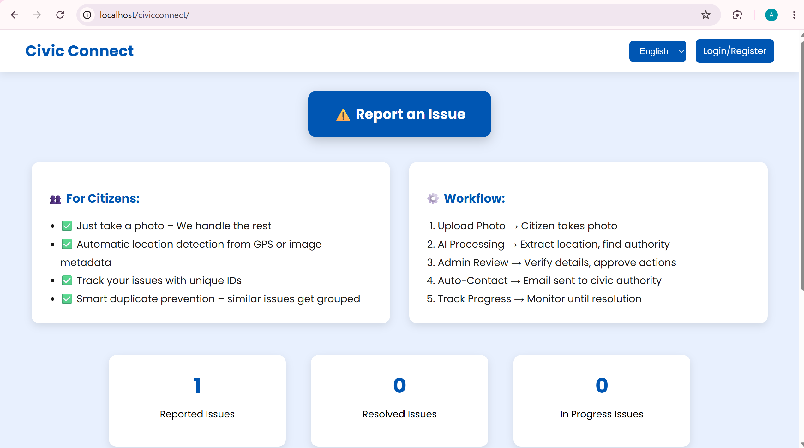
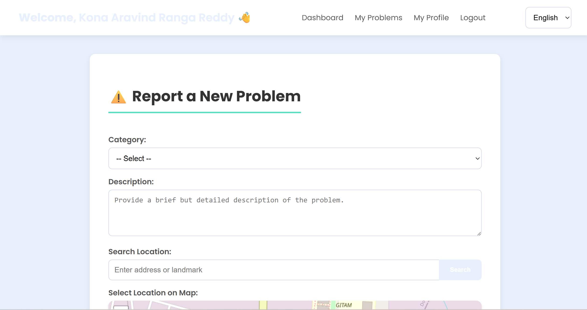
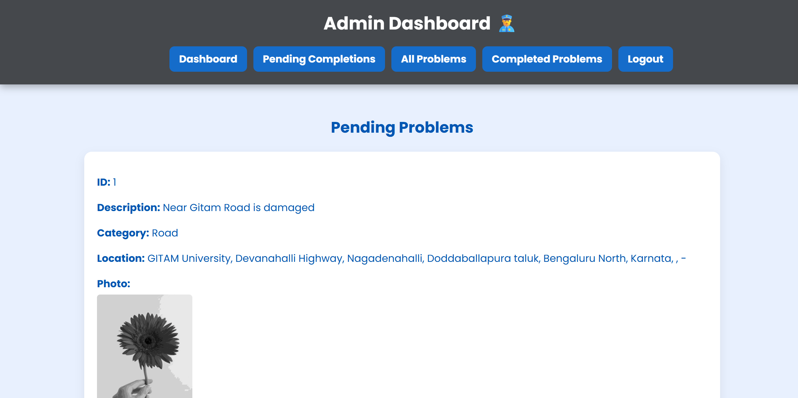

# CivicConnect 🏙️

A web-based platform that enables citizens to report civic issues directly to local authorities while allowing administrators to manage complaints and workers to resolve them efficiently.

---

## 📌 Overview

CivicConnect bridges the gap between citizens and municipal authorities by providing a centralized platform for reporting and tracking public issues such as potholes, garbage accumulation, streetlight failures, drainage problems, and more.

The system supports multiple user roles and streamlines the complaint resolution process from reporting to completion.

---

## ✨ Features

### 👥 Citizen Portal
- User Registration & Login
- Report civic issues with description and photo
- Select issue location using OpenStreetMap
- Track complaint status
- Manage profile information
- Multi-language support


### 👨‍💼 Admin Portal
- Admin authentication
- Manage citizens and workers
- Allocate complaints to workers
- Monitor complaint progress
- View issue reports

---

## 🗺️ Map Integration

- OpenStreetMap
- Leaflet.js
- Location-based issue reporting
- Address selection using interactive maps

---

## 🛠️ Tech Stack

### Frontend
- HTML5
- CSS3
- JavaScript
- Bootstrap

### Backend
- PHP

### Database
- MySQL

### Other Technologies
- PHPMailer
- Leaflet.js
- OpenStreetMap

---

## 📂 Project Structure

```
CivicConnect/
│
├── adminlogin/
├── peoplelogin/
├── workerlogin/
├── db/
├── images/
├── lang/
├── PHPMailer/
└── index.php
```

---

## 🗄️ Database

Database Name:

```
gov_problems
```

Import the provided SQL file into MySQL before running the project.

---

## 🚀 Installation

1. Install XAMPP.
2. Start Apache and MySQL.
3. Copy the project into:

```
C:\xampp\htdocs\
```

4. Import the SQL file into phpMyAdmin.

5. Open:

```
http://localhost/CivicConnect
```

---

## 🔑 User Roles

- Citizen
- Worker
- Administrator

---

## 📸 Screenshots

Add screenshots here after uploading the project.

Example:

```
## Screenshots

### Home Page



### Report Issue



### Admin Dashboard




## 🎯 Future Improvements

- Real-time complaint tracking
- AI-based issue categorization
- Mobile application
- Analytics dashboard

---

## 👨‍💻 Author

**Kona Aravind Ranga Reddy**

B.Tech Artificial Intelligence & Machine Learning

GitHub: https://github.com/aravindkona18090

LinkedIn: www.linkedin.com/in/kona-aravind-ranga-reddy-1736b0344

---

## 📄 License

This project is developed for educational and portfolio purposes.
